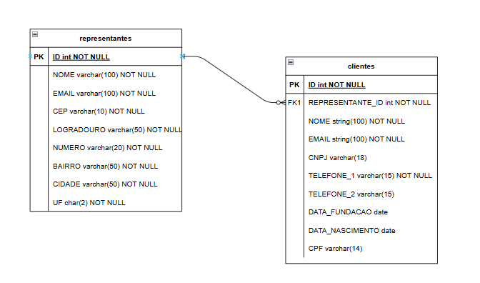

## O que é o projeto?

O projeto faz parte de um case da empresa penalty em que participei.

O projeto tem os seguintes requisitos:

Cadastro de representante:
- [x] Nome
- [x] E-mail
- [x] CEP
- [x] Logradouro
- [x] Número
- [x] Bairro
- [x] Cidade
- [x] UF


Cadastro de cliente:
- [x] Nome
- [x] E-mail
- [x] CNPJ ou CPF
- [x] Telefone(s)
- [x] Data de Fundação do CNPJ ou data de nascimento do CPF
- [x] Representante


Funcionalidades adicionais:
- [x] Listar representantes cadastrados e listar clientes cadastrados por representante

Regras:

1. Ao digitar o CEP, consumir a API (https://viacep.com.br/) para preencher 
automaticamente as informações de logradouro, bairro, cidade e UF do 
formulário; 
2. A listagem de representantes deverá conter filtros por nome e e-mail; 
3. Implementar a função de deletar representante; 
4. Permitir alterar o representante do cliente; 
5. Utilizar autenticação de usuário para o ambiente administrativo; 
6. Se cliente for CPF, somente permitir o cadastro para maiores de 18 anos; 
7. No front-end, utilizar Bootstrap (https://getbootstrap.com/), será analisado a 
usabilidade e o responsivo (desktop, tablet e mobile); 
8. Utilizar pelo menos duas boas práticas de segurança da informação em 
formulários; 
9. Disponibilizar o código fonte em um repositório git. 

Criação do MER:

A criação deste diagrama MER ajudará a entender quais tabelas adicionais foram criadas e quais suas relação, que neste caso são: representantes (1,n) - clientes (1, 1)




## Requisitos do projeto

Para iniciar é necessários que tenha instalado em sua máquina:
- [Composer](https://getcomposer.org/)
- [PHP](https://www.php.net/downloads) (v. >= 8.2)
- [Node](https://nodejs.org/en/) (Recomendado versão LTS)
- [NPM](https://getcomposer.org/) (Instalando o node, o npm vem junto.)


## Como iniciar

1. Primeiramente, clonaremos o projeto:

    ```sh
    git clone https://github.com/WesleyRodrigues55/case-penalty.git
    ```

2. Acessar a pasta do projeto clonado:

    ```sh
    cd case-penalty
    ```

3. Execute o comando abaixo para instalar todas as dependências do PHP listadas no arquivo `composer.json`:

    ```sh
    composer install
    ```

4. Instale também as dependências do Node.js do arquivo `package.json`

    ```sh
    npm install
    ```

5. Após as instalaçõesa acima estiverem concluídas, procure na raíz do projeto pelo arquivo `.env-example` e duplique ele com o nome `.env`.


6. Gere uma nova chave para o aplicativo laravel.

    ```sh
    php artisan key:generate
    ```

7. Execute as migrações para criar as tabelas no banco de dados configurado (estamos usando o database.sqlite neste projeto)

    ```sh
    php artisan migrate
    ```

8. Compile os ativos front-end (CSS, JavaScript) usando Laravel Mix:

    ```sh
    npm run dev
    ```

7. Inicie o servidor de desenvolvimento do Laravel:

    ```sh
    php artisan serve
    ```


após esse passo a passo você será possível de navegador no aplicativo, o link padrão é `http://127.0.0.1:8000/`.

Inicie criando uma conta de usuário e acesse a aplicação. As funcionalidades de acordo com os requisitos descritos no início dessa documentação estão todas funcionais.